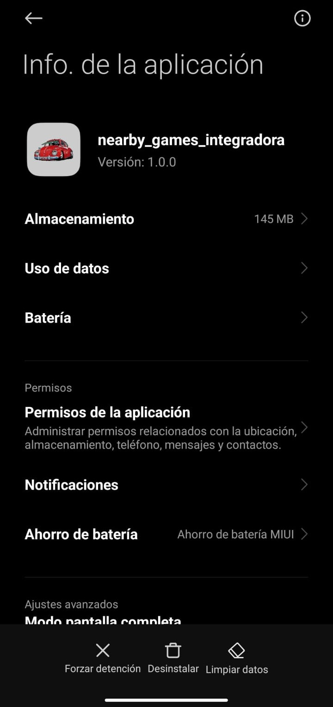
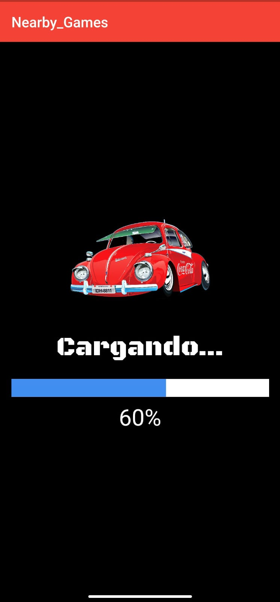

# Nearby Games 
# Rush Road: La Carrera por la Supervivencia

## Capturas de Pantalla

  
  
  
  

Este repositorio contiene el código fuente de la aplicación móvil "Rush Road: La Carrera por la Supervivencia". La aplicación está desarrollada en Flutter y consta de varias pantallas, incluyendo un Splash Screen y la pantalla principal del juego.

## Descripción del Proyecto

- **Título del Videojuego**: Rush Road: La Carrera por la Supervivencia
- **Género**: Acción / Aventura

## Descripción del Juego

"Rush Road: La Carrera por la Supervivencia" es un emocionante juego de Carreras de Acción / Aventura ambientado en una ciudad devastada por la pandemia y la decadencia económica. Los jugadores asumen el papel de Eliel-Kun y Bob Patiño, choferes de transporte público, quienes se ven obligados a competir en carreras ilegales para proteger a sus familias y sobrevivir en un mundo lleno de peligros.

En su travesía, los protagonistas enfrentarán a mafiosos despiadados, formarán alianzas inesperadas y desentrañarán una trama de corrupción que ha sumido a la ciudad en el caos. Para tener éxito, los jugadores deberán demostrar velocidad, astucia y coraje en cada carrera y descubrir la verdad detrás de la decadencia de la ciudad.

## Estructura del Repositorio

El repositorio está organizado de la siguiente manera:

- `lib/home.dart`: Este archivo contiene el código fuente de la pantalla principal de la aplicación.

- `lib/main.dart`: Aquí se encuentra el código principal de la aplicación, donde se configura y se inicia la aplicación Flutter. Además, se establece un retraso antes de navegar a la pantalla principal.

- `lib/splash_screen.dart`: Este archivo contiene el código fuente de la pantalla de inicio (Splash Screen) de la aplicación. En esta pantalla, se simula una carga mientras se muestra una barra de progreso antes de dirigirse a la pantalla principal del juego.

- Otros archivos y carpetas: El repositorio puede incluir otros recursos como imágenes, fuentes o archivos de configuración según sea necesario para el proyecto.

## Instrucciones de Uso

Para utilizar este repositorio y ejecutar la aplicación:

1. Asegúrate de tener Flutter y Dart instalados en tu sistema.

2. Clona este repositorio en tu máquina local.

3. Ejecuta `flutter pub get` para obtener las dependencias necesarias.

4. Ejecuta la aplicación con el comando `flutter run`.

## Créditos
- Asignatura: Desarrollo Móvil Integral
- Grado: 10
- Grupo: "A"
- Docente: MTI. Marco Antonio Ramirez Hernandez

